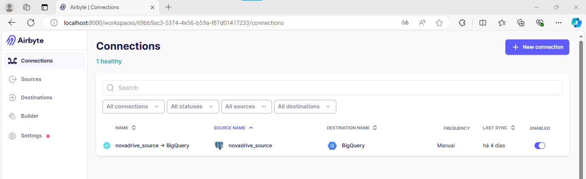
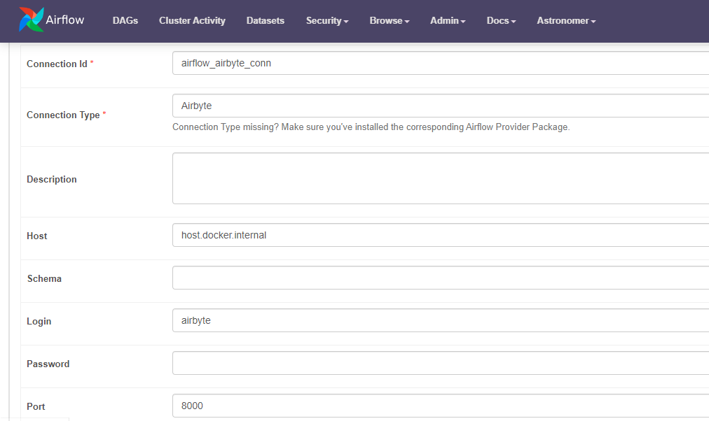
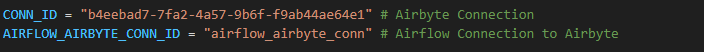
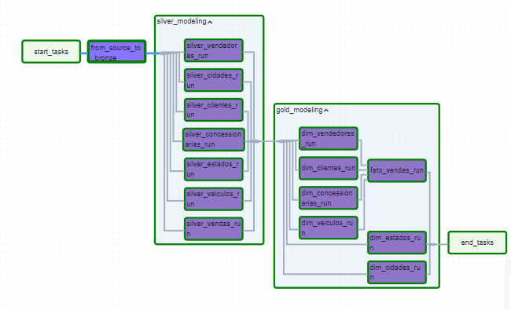
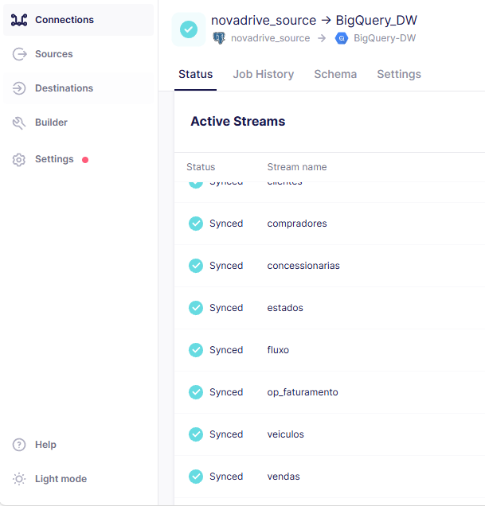
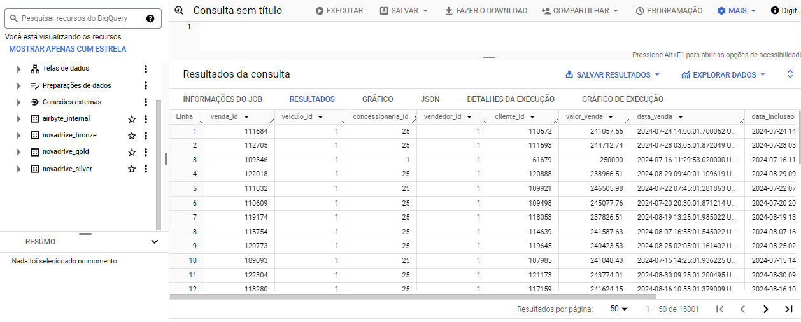
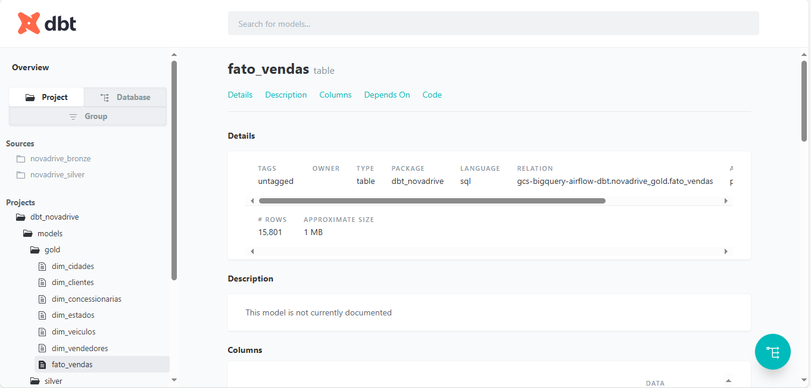
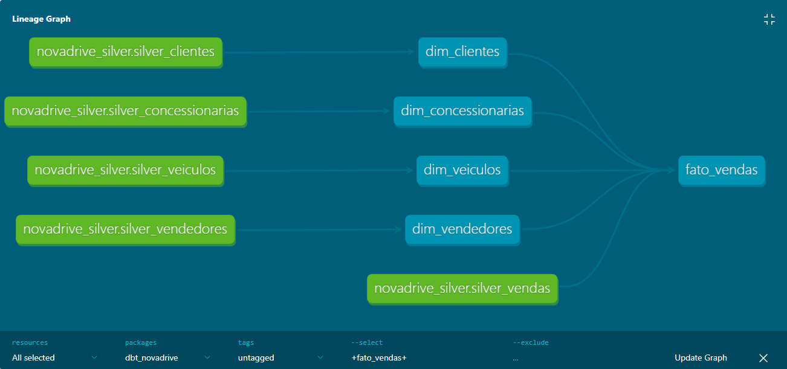

# End-to-end Mordern Data Stack Pipeline using Postgres, Airbyte, DBT, Airflow and Bigquery 🚀


---

## Summary

1. **[Project Overview](#project-overview)**  
   1.1 **[Introduction](#introduction)**  
   1.2 **[Objectives](#objectives)**  
   1.3 **[Flow of the Architecture](#flow-of-the-architecture)**  
   1.4 **[Technologies Used](#technologies-used)**  

2. **[Architecture Explanation](#architecture-explanation)**  
   2.1 **[Medallion Architecture in BigQuery](#medallion-architecture-in-bigquery)**  

3. **[Setup and Configuration](#setup-and-configuration)**  
   3.1 **[Install Docker](#install-docker)**  
   3.2 **[Install Astro CLI](#install-astro-cli)**  
   3.3 **[Install Airbyte](#install-airbyte)**  
   3.4 **[Install DBT](#install-dbt)**  
   3.5 **[Clone the GitHub Repo](#clone-the-github-repo)**  
   3.6 **[Reinitialize the Airflow Project](#reinitialize-the-airflow-project)**  
   3.7 **[Build the Project](#build-the-project)**  
   3.8 **[Create the GCP Project](#create-the-gcp-project)**  
   3.9 **[Create a Service Account for the Project](#create-a-service-account-for-the-project)**  
   3.10 **[Create an Airbyte Connection](#create-an-airbyte-connection)**  

4. **[DBT Configuration's Example](#dbt-configurations-example)**  
   4.1 **[Install DBT](#install-dbt)**  
   4.2 **[Project Setup](#project-setup)**  
   4.3 **[DBT Models](#dbt-models)**  

5. **[Deployment and Execution](#deployment-and-execution)**  
   5.1 **[All Set, Start the DAG](#all-set-start-the-dag)**  

6. **[DBT Documentation](#dbt-documentation)**  
   6.1 **[How It Works](#how-it-works)**  
   6.2 **[How to Generate Documentation](#how-to-generate-documentation)**  
   6.3 **[Documentation Results](#documentation-results)**  

7. **[Infrastructure Deployment (Bonus)](#infrastructure-deployment-bonus)**  
   7.1 **[How It Works](#how-it-works-1)**  
   7.2 **[How to Use It](#how-to-use-it)**  

8. **[Conclusion](#conclusion)**  
   8.1 **[Summary](#summary-1)**  
   8.2 **[Future Enhancements](#future-enhancements)**  
   8.3 **[References](#references)**  

---


# Project Overview
#### Introduction

*This project automates a data pipeline for the novadrive system, which manages data transformation and analysis across multiple stages: bronze, silver, and gold layers. The project is designed to extract data from a Postgres database using Airbyte, transform the data using DBT (Data Build Tool), and orchestrate the workflow with Airflow.*

#### Objectives
* Automate data extraction from Postgres using Airbyte.
* Transform raw data into structured data using DBT.
* Manage and orchestrate the entire data pipeline using Airflow.

#### Flow of the Architecture

* **Source Data Ingestion with Airbyte**
    * Airbyte is responsible for syncing raw data from the Postgres database to the bronze layer in BigQuery.
    * Airbyte ensures that the data is reliably ingested, handling any necessary data type conversions.

* **Bronze Layer**: Managed by **Airbyte**, this layer ingests raw data from the Postgres database into **BigQuery**.
* **Silver Layer**: Managed by **DBT**, this layer cleans and standardizes the data from the **bronze layer**.
* **Gold Layer**: Also managed by **DBT**, this layer further refines the data, making it ready for analysis and reporting.

* **Orchestration with Airflow**
    * **Airflow DAG**: Orchestrates the data pipeline, ensuring that Airbyte and DBT tasks are executed in the correct order.
    * **Task Flow**: The DAG first triggers the Airbyte sync, then runs the DBT models for the silver and gold layers.

* **Git and GitHub for Version Control**
    * **Git/Github**: In this project, we use Git to version all the data pipeline code, and GitHub to manage the repository, ensure collaboration, and maintain a clear history of changes over time. This ensures that the code is kept organized, traceable, and recoverable if needed.


#### Technologies Used
* **Airbyte**: For data ingestion from Postgres to BigQuery.
* **DBT (Data Build Tool)**: For transforming and structuring the data in BigQuery.
* **Airflow**: For orchestrating the entire data pipeline, ensuring tasks are executed in the correct order.
* **Git/Github**: Versoning all the data pipeline code, and GitHub to manage the repository.
___

# Architecture Explanation

### Medallion Architecture in BigQuery

The **Medallion Architecture** is a data architecture approach that organizes data into different layers (Bronze, Silver, and Gold), each with an increasing level of refinement and quality. In the context of BigQuery, we use this architecture to structure data as follows:

- **Bronze Layer**: Raw and unprocessed data, loaded directly from the source using Airbyte.
- **Silver Layer**: Cleaned and transformed data, prepared for analysis, using DBT to transform and organize the data.
- **Gold Layer**: Highly refined data, ready for consumption by dashboards and business analytics.

This architecture allows for better organization, governance, and scalability of the data, making it easier to trace and continually refine the data as it progresses through the different layers.

# Setup and Configuration

### Install Docker
[Install Docker for your OS](https://docs.docker.com/desktop/)

### Install Astro CLI 
[Install Astro CLI for your OS](https://www.astronomer.io/docs/astro/cli/install-cli)

### Install Airbyte
[Follow the official Airbyte documentation to install and configure Airbyte locally or on a server.](https://docs.airbyte.com/using-airbyte/getting-started/oss-quickstart)

### Install DBT
[DBT Documentation.](https://docs.getdbt.com/docs/core/pip-install)
___

### Clone the GitHub repo

In your terminal:

Clone the repo using Github CLI or Git CLI

```bash
git clone https://github.com/Brunotorres15/postgres-airbyte-dbt-airflow-bigquery
```

Open the folder with your code editor.

### Reinitialize the Airflow project
Open the code editor terminal:
```bash
astro dev init
```
It will ask: ```You are not in an empty directory. Are you sure you want to initialize a project? (y/n)```
Type ```y``` and the project will be reinitialized.


### Build the project
In the code editor terminal, type:

```bash
astro dev start
```
The default Airflow endpoint is http://localhost:8080/
- Default username: admin
- Default password: admin


## Create the GCP project

In your browser go to https://console.cloud.google.com/ and create a project, something like: ```postgres-airbyte-bigquery-dbt-airflow```

You will have to use your Project ID in the **sources.yaml** and **profile.yml** files.

### Create a service account for the project

Go to the IAM tab, and create the Service account with a name of your choice.
Give admin access to BigQuery, and export the json keys. Rename the file to service_account.json and put inside the folder ```dbt_novadrive/gcp/``` (you will have to create this folder).

You will have to use your **service_account.json** in the **dbt_project.yml** file and also pass it to the **Airbyte Connection** while setting up your destination to  Bigquery.


### Create an Airbyte Connection 
* Set up a connection in Airbyte from your Postgres database to your BigQuery project.
* Click in **Connections** > **New Connection**.

    

* Set Up The Airbyte Connection in Airflow.
* **Click in Admin** > **Connections** > **Add a New Record**.


* Configure the AIRFLOW_AIRBYTE_CONN_ID and CONN_ID in the Airflow Dag to connect with Airbyte.
* The **Airbyte Connection** is the ID after **"connections/"** in Airbyte's URL




# DBT Configuration's Example

***All the setup were already done in this project, so this is just an example of how you could do this yourself if you want to.***

* **Install DBT**: Use the official DBT documentation to install DBT locally or on your server.
* **Project Setup**:
    * Define your project and profile configurations (profiles.yml and dbt_project.yml) to connect DBT with BigQuery.
    * Organize your DBT models into silver and gold directories.
* **DBT Models**:
    * Create SQL models to transform the data in the silver and gold layers.
    * Use DBT's source feature to reference tables in the bronze layer.

# Deployment and Execution

### All set, start the DAG

With your Airflow running, go to http://localhost:8080/ and click on DAGs, and click on the **novadrive_dag** DAG.
Then, start the DAG (play button on the upper right side).

It will go step by step, and if everything was followed, you will get a green execution at the end.
Check in your Airbyte's Status if the Sync was successfull, in your Bigquery database if the tables has been built and if the data was uploaded succesfully.

You should get something like this:

* **Airflow**



* **Airbyte**



* **Bigquery**




# **DBT's Docummentation**

**DBT’s documentation feature automatically generates detailed, interactive documentation for your data models, sources, and transformations.**

### How It Works:
**Automatic Generation**: Documentation is created based on the configurations in your DBT project, including descriptions and metadata from your schema.yml files.

**Interactive Interface**: Users can explore data models, columns, and their relationships through a web-based interface.

### Advantages:
**Transparency**: Clarifies data lineage and transformations. \
**Collaboration**: Enhances team communication and understanding. \
**Efficiency**: Saves time by automating documentation updates and providing easy access to data details.

This approach ensures that documentation remains current and useful, facilitating better data management and collaboration.
___
### How to generate it

#### Generate the documentation files
```dbt docs generate```

#### Serve the documentation locally
```dbt docs serve```

#### You can access it by going to
```http://localhost:8080```

# Documentation Results





# **Infrastructure Deployment (Bonus)**

### Inside the `infra` folder, there's a complete solution to deploy an S3 Bucket and an EC2 instance on AWS to run Airflow and DBT.

## How It Works

1. **Terraform Deployment**: 
    - When you execute the Terraform scripts, it will first create an S3 bucket. This bucket is used to store the scripts located in the `app` folder.
   
2. **EC2 Instance Setup**: 
    - After the S3 bucket is created, Terraform will deploy an EC2 instance. This instance will automatically synchronize with the scripts stored in S3 and execute them. As a result, both Airflow and DBT will be running on the cloud.
   
3. **Access**: 
    - You can access Airflow by navigating to `http://<your-ec2-instance-ip>:8080` in your browser.

## How to Use It

1. **Download Terraform**: [Terraform Download](https://www.terraform.io/downloads)
2. **Download AWS CLI**: [AWS CLI Download](https://aws.amazon.com/cli/)

3. **Expose Airflow's port**: Go to the `app` folder and execute ```astro config set -g airflow.expose_port 8080```

4. **Modify the Configuration**:
    - Open the `variables.tfvars` file.
    - Add the name for the S3 bucket that will be created to store the scripts:
      ```hcl
      bucket_name = "your-s3-bucket-name"
      ```

5. **Initialize and Apply Terraform**:
    - Run the following commands to initialize and deploy the infrastructure:
      ```bash
      terraform init
      terraform apply -var-file=variables.tfvars
      ```

6. **Destroy the Infrastructure**:
    - When you're done, you can clean up the resources by running:
      ```bash
      terraform destroy -var-file=variables.tfvars
      ```

## **Conclusion**
### **Summary**

*This project demonstrates a scalable and automated approach to managing data pipelines using Airbyte, DBT, and Airflow. The pipeline efficiently handles data ingestion, transformation, and orchestration, ensuring reliable data flow from source to analysis.*

### **Future Enhancements**

**Add Data Quality Checks**: Implement data quality checks within DBT to ensure the accuracy and consistency of the data.

**Optimize Performance if necessary**: Explore opportunities to optimize the performance of Airbyte syncs and DBT transformations.

---

### **References**
Airbyte Documentation: https://docs.airbyte.com

DBT Documentation: https://docs.getdbt.com

Airflow Documentation: https://airflow.apache.org/docs

Astronomer Cosmos: https://astronomer.github.io/astronomer-cosmos/index.html