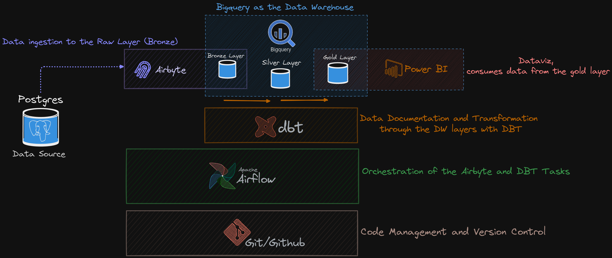

# End-to-end Mordern Data Stack Pipeline using Postgres, Airbyte, DBT, Airflow and Bigquery 🚀

## Documentation Index

Aqui está o índice replicado para os outros tópicos:

---

1. **[Project Overview](#project-overview)**  
   1.1 **[Introduction](#introduction)**  
   1.2 **[Objectives](#objectives)**  
   1.3 **[Data Flow Architecture](#data-flow-architecture)**  
   1.4 **[Technologies Used](#technologies-used)**  
   1.5 **[Setup and Configuration](#setup-and-configuration)**

2. **[Setup and Configuration](#setup-and-configuration)**  
   2.1 **[Prerequisites](#prerequisites)**  
   2.2 **[Airbyte Configuration](#airbyte-configuration)**  
   2.3 **[DBT Configuration](#dbt-configuration)**  
   2.4 **[Airflow DAG Setup](#airflow-dag-setup)**

3. **[Data Pipeline Explanation](#data-pipeline-explanation)**  
   3.1 **[Medallion Architecture in BigQuery](#medallion-architecture-in-bigquery)**  
   3.2 **[Git and GitHub for Version Control](#git-and-github-for-version-control)**  
   3.3 **[Source Data Ingestion with Airbyte](#source-data-ingestion-with-airbyte)**  
   3.4 **[Data Transformation with DBT](#data-transformation-with-dbt)**  
   3.5 **[Orchestration with Airflow](#orchestration-with-airflow)**

4. **[Deployment and Execution](#deployment-and-execution)**  
   4.1 **[Deploying the Data Pipeline](#deploying-the-data-pipeline)**  
   4.2 **[Monitoring and Debugging](#monitoring-and-debugging)**  
   4.3 **[Maintenance and Updates](#maintenance-and-updates)**

5. **[Conclusion](#conclusion)**  
   5.1 **[Summary](#summary)**  
   5.2 **[Future Enhancements](#future-enhancements)**  
   5.3 **[References](#references)**

---

# Project Overview
#### Introduction

*This project automates a data pipeline for the novadrive system, which manages data transformation and analysis across multiple stages: bronze, silver, and gold layers. The project is designed to extract data from a Postgres database using Airbyte, transform the data using DBT (Data Build Tool), and orchestrate the workflow with Airflow.*

#### Objectives
* Automate data extraction from Postgres using Airbyte.
* Transform raw data into structured data using DBT.
* Manage and orchestrate the entire data pipeline using Airflow.

#### Data Flow Architecture

* **Bronze Layer**: Managed by **Airbyte**, this layer ingests raw data from the Postgres database into **BigQuery**.
* **Silver Layer**: Managed by **DBT**, this layer cleans and standardizes the data from the **bronze layer**.
* **Gold Layer**: Also managed by **DBT**, this layer further refines the data, making it ready for analysis and reporting.

#### Technologies Used
* **Airbyte**: For data ingestion from Postgres to BigQuery.
* **DBT (Data Build Tool)**: For transforming and structuring the data in BigQuery.
* **Airflow**: For orchestrating the entire data pipeline, ensuring tasks are executed in the correct order.

___

## Setup and Configuration

* **Install Airbyte**: Follow the official Airbyte documentation to install and configure Airbyte locally or on a server.
* **Create a Connection**: Set up a connection in Airbyte from your Postgres database to your BigQuery project.
* **Set Up Airbyte in Airflow**: 
    * Configure the AIRFLOW_AIRBYTE_CONN_ID in Airflow to connect with Airbyte.
    * Ensure that Airbyte syncs data to the bronze layer in BigQuery.

## DBT Configuration
* **Install DBT**: Use the official DBT documentation to install DBT locally or on your server.
* **Project Setup**:
    * Define your project and profile configurations to connect DBT with BigQuery.
    * Organize your DBT models into silver and gold directories.
* **DBT Models**:
    * Create SQL models to transform the data in the silver and gold layers.
    * Use DBT's source feature to reference tables in the bronze layer.

## Airflow DAG Setup
* **Create the DAG**:
    * Define the data pipeline DAG in Airflow.
    * Include tasks to trigger Airbyte syncs, run DBT models, and orchestrate the entire workflow.
* **Schedule the DAG**: Set the schedule to run the pipeline at your desired frequency, such as hourly.
* **Task Grouping**: Use Airflow’s task groups to manage DBT transformations for the silver and gold layers.

## Data Pipeline Explanation

### Medallion Architecture in BigQuery

The **Medallion Architecture** is a data architecture approach that organizes data into different layers (Bronze, Silver, and Gold), each with an increasing level of refinement and quality. In the context of BigQuery, we use this architecture to structure data as follows:

- **Bronze Layer**: Raw and unprocessed data, loaded directly from the source using Airbyte.
- **Silver Layer**: Cleaned and transformed data, prepared for analysis, using DBT to transform and organize the data.
- **Gold Layer**: Highly refined data, ready for consumption by dashboards and business analytics.

This architecture allows for better organization, governance, and scalability of the data, making it easier to trace and continually refine the data as it progresses through the different layers.

### Git and GitHub for Version Control

**Git** is a version control tool that allows developers to track changes in the code over time, revert to previous versions, and collaborate with other developers. **GitHub** is a Git-based platform that facilitates hosting repositories, collaboration, and code review, as well as providing tools for project management.

In this project, we use Git to version all the data pipeline code, and GitHub to manage the repository, ensure collaboration, and maintain a clear history of changes over time. This ensures that the code is kept organized, traceable, and recoverable if needed.

* **Source Data Ingestion with Airbyte**
    * Airbyte is responsible for syncing raw data from the Postgres database to the bronze layer in BigQuery.
    * Airbyte ensures that the data is reliably ingested, handling any necessary data type conversions.

 * **Data Transformation with DBT**
    * **Silver Layer**: DBT models in the silver layer focus on cleaning and structuring the data.
    * **Gold Layer**: DBT models in the gold layer refine the data further, preparing it for analysis and reporting.
    
* **Orchestration with Airflow**
    * **Airflow DAG**: Orchestrates the data pipeline, ensuring that Airbyte and DBT tasks are executed in the correct order.
    * **Task Flow**: The DAG first triggers the Airbyte sync, then runs the DBT models for the silver and gold layers.

## Deployment and Execution
* **Deploying the Data Pipeline**
    * **Deployment**: Deploy Airbyte, DBT, and Airflow in your preferred environment (local or cloud).
    * **Configuration**: Ensure all configurations are correct, including connections to BigQuery and Postgres.
* **Monitoring and Debugging**
    * **Airflow UI**: Monitor the DAG execution in the Airflow UI.
    * **Logs**: Check Airflow logs for any errors during the execution of Airbyte or DBT tasks.
    * **Airbyte UI**: Use the Airbyte UI to monitor syncs and troubleshoot any issues with data ingestion.
* **Maintenance and Updates**
    * **Updating DBT Models**: Periodically update your DBT models to accommodate changes in the data schema or business logic.
    * **Airflow DAGs**: Adjust the DAG schedule or task dependencies as needed to optimize the pipeline's performance.

## **Conclusion**
### **Summary**

*This project demonstrates a scalable and automated approach to managing data pipelines using Airbyte, DBT, and Airflow. The pipeline efficiently handles data ingestion, transformation, and orchestration, ensuring reliable data flow from source to analysis.*

### **Future Enhancements**

**Add Data Quality Checks**: Implement data quality checks within DBT to ensure the accuracy and consistency of the data.

**Optimize Performance**: Explore opportunities to optimize the performance of Airbyte syncs and DBT transformations.

### **References**
Airbyte Documentation: https://docs.airbyte.com

DBT Documentation: https://docs.getdbt.com

Airflow Documentation: https://airflow.apache.org/docs